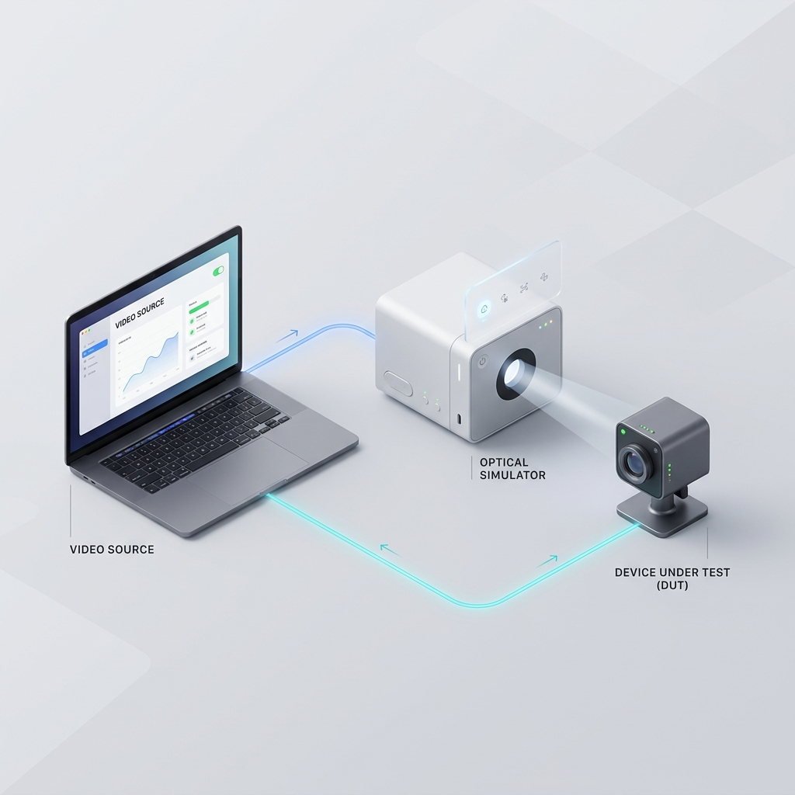
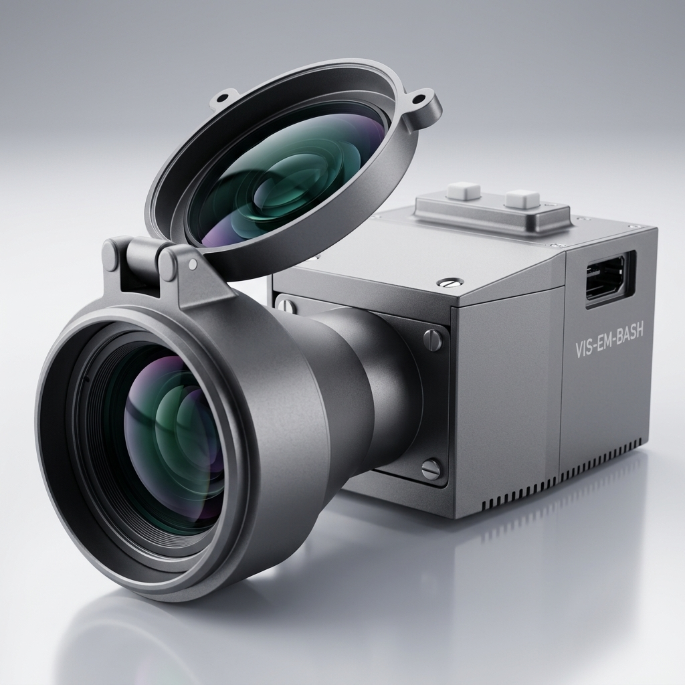
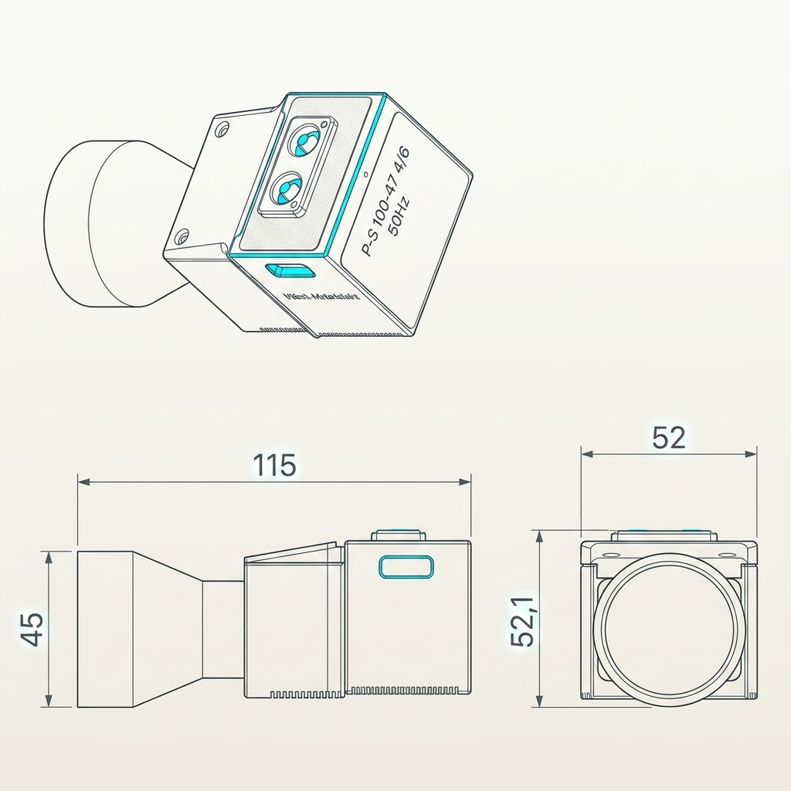

# 可见光目标模拟器：光电测试领航者

> **P³光电 (PeterPan Photonics)**  
> 本手册为可见光目标模拟器的标准产品技术规范与使用指南。采用语义化 Markdown 编写，配有极其精美的 3D 高清资产图、严谨且正向推演的技术参数表以及闭环使用流程。

---

## 1. 核心商业价值与应用场景

将不可控的自然环境，化为实验室里的精准光束。告别“外场看天吃饭”的窘境。

### 1.1 核心收益
* **极速降本增效**：在实验室内实现全天候目标仿真，将漫长、昂贵的外场飞行与车载测试缩短至室内几小时解决。
* **绝对零风险闭环**：封闭环境下的算法闭环硬件在环（HIL）验证，杜绝全新未验证算法在外场暴走导致设备损坏的风险。
* **一键无缝部署**：供电与视频一根 HDMI 线搞定。超大出瞳容差设计，让光学对准与共轴联调极度简化。

### 1.2 典型应用领域
1. ✈️ **机载光电吊舱 (EO/IR)**：视线隔离度、视轴稳定精度评估。
2. 🚗 **ADAS 智能驾驶视觉**：车载防抖、目标识别与硬件抗扰测试。
3. 🚀 **无人机/精确制导武器**：视觉导引头动态追踪捕捉验证。

---

## 2. 闭环测试工作流

测试电脑注入目标图像，模拟器瞬间化为无尽深空的实体靶标。光电设备的回馈数据实时返回终端，构成完美的硬件在环测试生态。

*图 2-1 硬件在环闭环测试工作流*

---

## 3. 结构尺寸与实物外观

采用航空级轻量化高强度铝合金结构设计，底部提供 **M3 / M4 / M5** 标准螺纹安装孔，可完美适应各种光学转台与云台。

| 模拟器实物渲染 | 系统尺寸工程蓝图 |
| :---: | :---: |
|  |  |
| *图 3-1 模拟器工业渲染外观图* | *图 3-2 模拟器工程结构蓝图* |

---

## 4. 极致技术参数及性能指标

### 4.1 光学与成像卓越性能

| 参数项目 | 指标参数 | 核心收益说明 |
| :--- | :--- | :--- |
| **光谱覆盖** | 0.48 ～ 0.8 μm | 完美匹配主流 CMOS/CCD 传感器响应曲线 |
| **画面均匀度** | ≥ 95% | 极致光学平整，靶标投射无边缘暗角与畸变 |
| **色彩与位深** | 8-bit | 支持 24-bit 真彩与单通道 256 阶高动态无断层过渡 |
| **图像解析力** | 1024 × 768 px | 高帧无损注入 |
| **视场角 (对角)** | ≥ 7.4° | 覆盖主流追踪视场 |

### 4.2 结构容差与可靠性

* **出瞳口径 / 距离**：≥ 30 mm / ≥ 20 mm（**超大容差设计，对准共轴极易操作**）
* **接口类型**：标准 HDMI 接口（供电与视频一线通）。
* **工作时间**：连续工作 ≥ 8 小时 / 平均无故障时间 (MTBF) ≥ 600 小时。
* **整机重量**：≤ 500 g。

---

## 5. 操作指南与品质承诺

### 5.1 使用流程
1. **一线部署**：使用 HDMI 线缆连接模拟器和测试电脑终端。
2. **信号源配置**：在电脑端设置外接显示的输出模式：频率 50Hz，分辨率 1024×768。
3. **光轴对准**：通过调整三脚架或云台，使模拟器发射轴与被测设备接收轴基本共轴。
4. **系统调节**：通过加、减按键调节模拟器出光亮度适应传感器，完成后长按加键可将当前配置写入设备持久保存。

### 5.2 品质与交付标准
每一台设备出厂前均经过严苛的光学标定与震动测试。

| 交付清单 | 数量 | 备注 |
| :--- | :--- | :--- |
| **可见光目标模拟器主机** | 1 套 | 核心单元 |
| **HDMI 一体化工装线** | 1 条 | - |
| **防震便携包装箱及辅件** | 1 套 | 包含镜头布、备用标准件等 |
| **高精度三脚架平台** | 1 台 | 按需选配 |

**无忧品质服务：**
✓ 提供定制化共轴工装夹具设计
✓ 原厂 1 对 1 在线支持
✓ 1 年标准原厂质保保障

---
*Copyright © 2026 P³光电(PeterPan Photonics). All rights reserved.*
